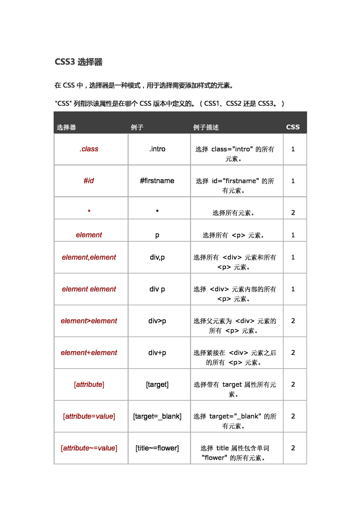
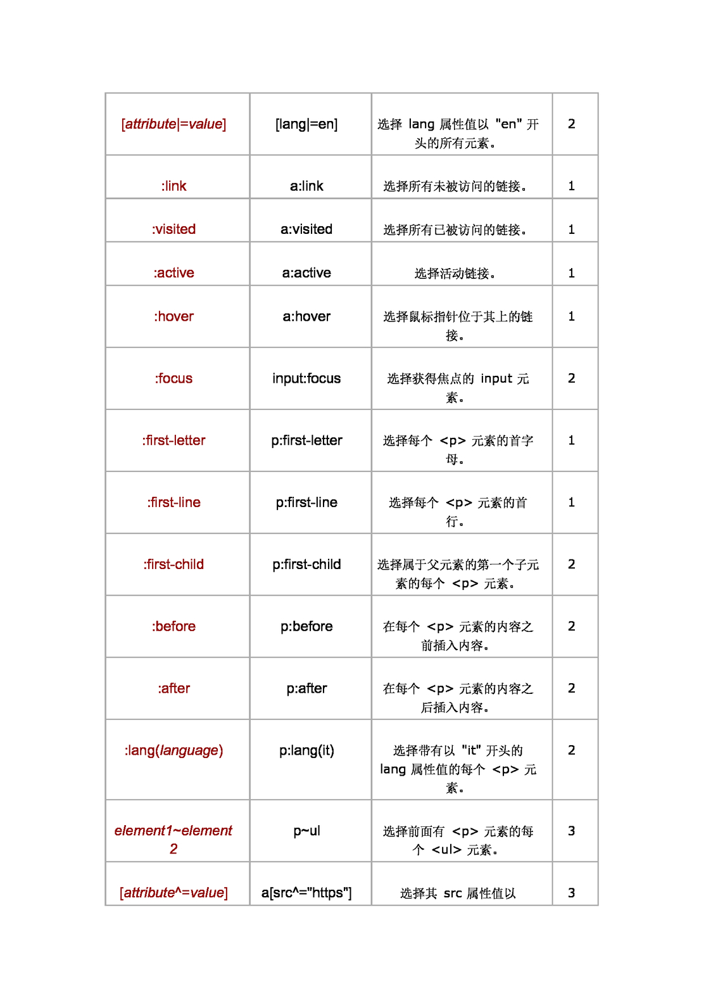
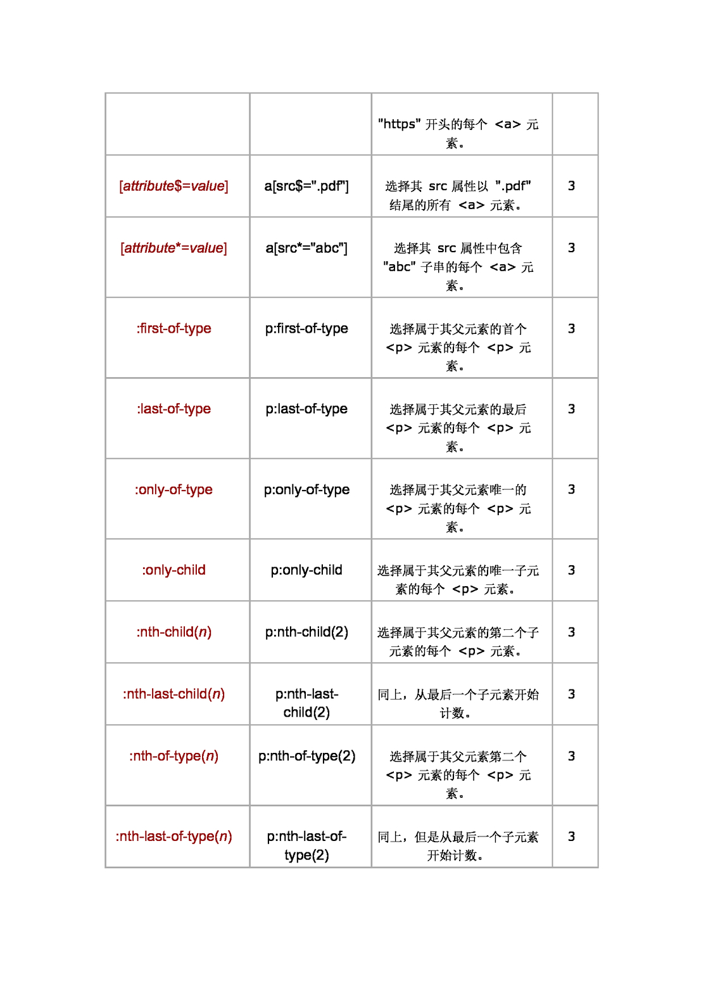
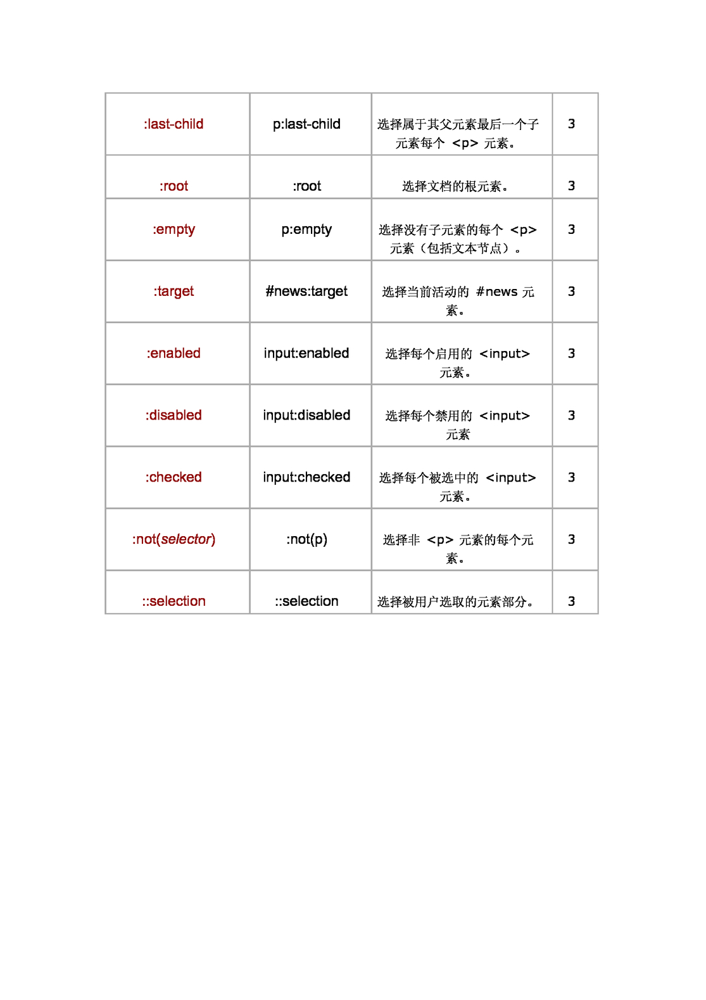

# 选择器的兼容性和优先级

[选择器的兼容性和优先级](https://kimblim.dk/css-tests/selectors/)

[搜索查看详细兼容情况](https://caniuse.com/)

## 优先级

| 优先级 | 选择器             | 权重    |
| ------ | ------------------ | ------- |
| 1      | !important         |         |
| 2      | 行内样式（style)   | 1,0,0,0 |
| 3      | ID 选择器          | 0,1,0,0 |
| 4      | class 选择器       | 0,0,1,0 |
| 5      | 元素选择器、伪元素 | 0,0,0,1 |
| 6      | 通配选择器         | 0,0,0,0 |

## 选择器优化效率

| 效率 | 选择器                     |
| ---- | -------------------------- |
| 1    | ID 选择器 #id              |
| 2    | class 选择器 .class        |
| 3    | 元素选择器 element         |
| 4    | 相邻兄弟选择器 例如，li+li |
| 5    | 子代选择器 例如，ul>li     |
| 6    | 后代选择器 例如，ul li     |
| 7    | 通配选择器  *              |
| 8    | 属性选择器 [type="text"]   |
| 9    | 伪类选择器 a:hover         |

**优化建议：**

1. 尽量不要使用通配选择器
2. 编写 id 规则时不要使用标签名或类名
3. 编写 class 不要使用标签名 ul.nav
4. 能依靠继承实现尽量依靠继承实现
5. Css3 新增选择器慎用，效率不高

## css 选择器

