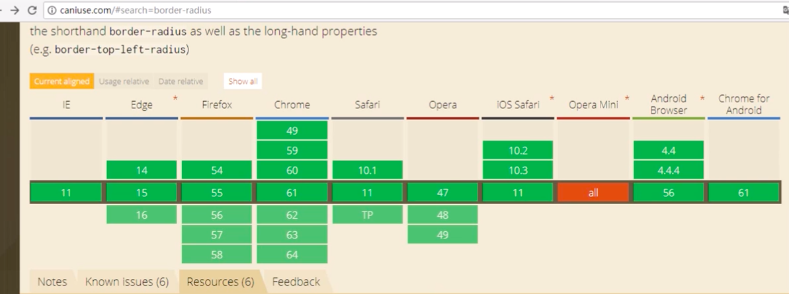
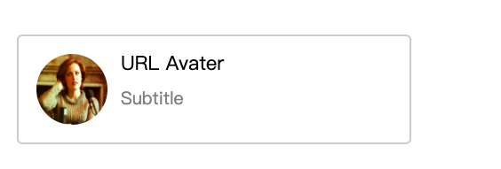

# css3 新增border属性

## border-radius圆角效果

### 在线工具

- <https://border-radius.com/>
- <https://css3gen.com/border-radius/>


### 兼容性

基本兼容大多数浏览器




### 解释

**border-radius: *px;** 四个角一样。

**border-radius: *px *px;**  左上和右下对于第 1 个参数、右上和左下对应第 2 个参数。

**border-radius: *px *px *px;**  左上对于第 1 个参数、右上和左下对应第 2 个参数，右下对于第 3 个参数。

**border-radius: *px *px *px *px;**  左上对于第 1 个参数、右上对应第 2 个参数，左下对应第 3 个参数，右下对于第 4 个参数。

**border-top-left-radius: *px, *px;** 第 1 个参数代表圆点距离左边框的值，第 2 个参数代表圆点距离上边框的值，以此 2 个点进行画弧，若只写 1 个参数，则代表圆点距离上边框和左边框都为该值。

**border-top-right-radius: *px, *px;** 类似 border-top-left-radius

**border-bottom-left-radius: *px, *px;** 类似 border-top-left-radius

**border-bottom-right-radius: *px, *px;** 类似 border-top-left-radius

### 代码展示

```html
<!DOCTYPE html>
<html>
<head>
	<title>边框圆角</title>
	<link rel="stylesheet" type="text/css" href="../../style.css">
	<style type="text/css">
		.container>div{
			width: 200px;
			height: 120px;
			background-color: skyblue;
			margin: 20px;
			padding-top: 80px;

		}
		.box1 {
			border-radius: none;
		}
		.box2 {
			border-radius: 20px;
		}
		.box3 {
			border-radius: 20px 40px;
		}
		.box4 {
			border-radius: 20px 40px 60px;
		}
		.box5 {
			border-radius: 20px 40px 60px 80px;
		}
		.box6 {
			border-top-left-radius: 40px 80px;
		}
		.box7 {
			border-radius: 100%;
		}
	</style>
</head>
<body>
	<div class="container">
		<div class="box1">border-radius: none;</div>
		<div class="box2">border-radius: 20px;</div>
		<div class="box3">border-radius: 20px 40px;</div>
		<div class="box4">border-radius: 20px 40px 60px;</div>
		<div class="box5">border-radius: 20px 40px 60px 80px;</div>
		<div class="box6">border-top-left-radius: 40px 80px;</div>
		<div class="box7">border-radius: 100%;</div>
	</div>
</body>
</html>
```

### 实践

#### 效果图



#### 实现代码

```html
<!DOCTYPE html>
<html>
<head>
	<title>圆角实践</title>
	<link rel="stylesheet" type="text/css" href="../../style.css">
	<style type="text/css">
		.user{
			width: 400px;
			border: 2px solid #ccc;
			border-radius: 6px;
			margin: 50px; 
			padding: 20px;
		}
		.user-info>img{
			width: 80px;
			height: 80px;
			border-radius: 100%;
			float: left;
			margin-right: 15px;
		}
		.user-avator{
			float: left;
		}
		.user-avator>span{
			display: block;
			height: 40px;
			line-height: 20px;
		}
		.user-avator-info {
			font-size: 22px;
		}
		.user-avator-subtitle {
			color: grey;
		}
	</style>
</head>
<body>
	<div class="user">
		<div class="user-info clearfix">
			
			<div class="user-avator">
				<span class="user-avator-info">URL Avater</span>
				<span class="user-avator-subtitle">Subtitle</span>
			</div>
		</div>
	</div>

</body>
</html>
```

