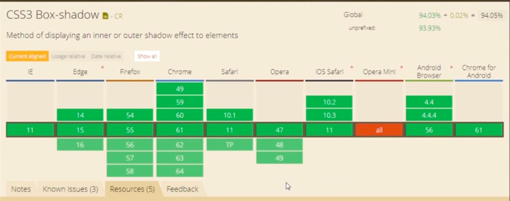
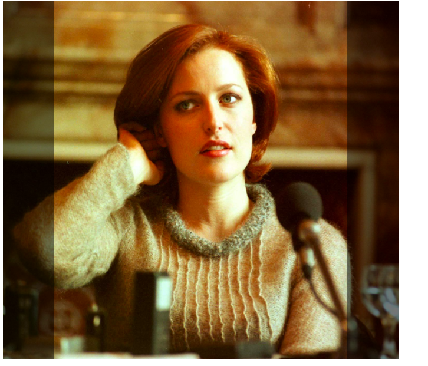

# css3 盒子阴影

## box-shadow

### 在线工具

- <<https://www.w3.org/TR/css-backgrounds-3/#propdef-box-shadow>

- <http://westciv.com/tools/shadows/>

### 兼容性




### 解释

**box-shadow: x-offset y-offset blur-radius spread-radius color ..**

**insert** 内阴影效果

**x-offset** 阴影水平方向偏移量

**y-offset **阴影垂直方向偏移量

**blur-radius **阴影模糊半径

**spread-radius **阴影扩展半径

**color **阴影颜色


### 代码展示

```html
<!DOCTYPE html>
<html>
<head>
	<title>盒子阴影</title>
	<link rel="stylesheet" type="text/css" href="../../style.css">
	<style type="text/css">
		.container>div{
			width: 200px;
			height: 120px;
			background-color: skyblue;
			margin: 20px;
			padding-top: 80px;
		}
		.box1{
			box-shadow: none;
		}
		.box2{
			box-shadow: 0 10px pink;
		}
		.box3{
			box-shadow: 10px 0 pink;
		}
		.box4{
			box-shadow: 10px 10px pink;
		}
		.box5{
			box-shadow: 10px 10px rgb(0,0,0,.5);
		}
		.box6{
			box-shadow: 10px 10px 5px rgb(0,0,0,.5);
		}
		.box7{
			box-shadow: 7px 7px 10px 5px #d640d6;
		}
		.box8{
			box-shadow: inset 7px 7px 10px 5px #d640d6;
		}
		.box9{
			box-shadow: 10px 10px pink,-10px -10px rgb(0,0,0,.5);
		}
	</style>
</head>
<body>
	<div class="container">
		<div class="box1">box-shadow: none;</div>
		<div class="box2">box-shadow: 0 10px pink;</div>
		<div class="box3">box-shadow: 10px 0 pink;</div>
		<div class="box4">box-shadow: 10px 10px pink;</div>
		<div class="box5">box-shadow: 10px 10px rgb(0,0,0,.5);</div>
		<div class="box6">box-shadow: 10px 10px 5px rgb(0,0,0,.5);</div>
		<div class="box7">box-shadow: 7px 7px 10px 5px #d640d6;</div>
		<div class="box8">box-shadow: insert 7px 7px 10px 5px #d640d6;</div>
		<div class="box9">box-shadow: 10px 10px pink,10px 10px rgb(0,0,0,.5);</div>

	</div>
</body>
</html>
```

### 实践

#### 效果图



#### 实现代码

```html
<!DOCTYPE html>
<html>
<head>
	<title>盒子阴影-应用</title>
	<link rel="stylesheet" type="text/css" href="../../style.css">
	<style type="text/css">
		.container {
			width: 960px;
			margin: 40px auto;
			font-size: 20px;
		}
		.box-hv {
			transition: all .6s;
		}
		.box-hv.left-right-open:hover {
			box-shadow: inset 0 0 0 0 rgb(0,0,0,.5),inset 0 0 0 0 rgb(0,0,0,.5);
		}
		.test {
			width: 671px;
			height: 607px;
			box-shadow: inset 335px 0 0 0 rgb(0,0,0,.5),inset -336px 0 0 0 rgb(0,0,0,.5);
			background-image: url('./demo-0.png');
		}
		
	</style>
</head>
<body>
	<div class="container">
		<div class="box-hv left-right-open test"></div>
	</div>
</body>
</html>
```


### box-shadow 按钮组

```html
<!DOCTYPE html>
<html>
<head>
	<title>盒子阴影-按钮</title>
	<link rel="stylesheet" type="text/css" href="../../style.css">
	<style type="text/css">
		.container {
			width: 960px;
			margin: 0 auto;
			font-size: 20px;
		}
		a {
			display: block;
			width: 300px;
			height: 150px;
			background-color: #abcdef;
			margin: 50px;
			line-height: 150px;
			color: #333;
			text-align: center;
			border-radius: 10px;
			transition: all .6s;
		}
		.btn-left:hover {
			box-shadow: inset 300px 0 rgba(0,0,0,.5);

		}
		.btn-right:hover {
			box-shadow: -300px 0 rgba(0,0,0,.5) inset;
		}
		.btn-inset:hover {
			box-shadow:  0 0 0 15px rgba(0,0,0,.5) inset;
		}
		.btn-inset-inset:hover {
			box-shadow: 0 0 0 15px rgba(0,0,0,.8) inset, 0 0 0 150px rgba(0,0,0,.5) inset;
		}
		.left-right:hover {
			box-shadow: inset 100px 0 rgba(0,0,0,.5), inset -100px 0 rgba(0,0,0,.5) ;
		}
	</style>
</head>
<body>
	<div class="container">
		<a href="#" class="btn-left">btn-left</a>
		<a href="#" class="btn-right">btn-right</a>
		<a href="#" class="btn-inset">btn-inset</a>
		<a href="#" class="btn-inset-inset">btn-inset-inset</a>
		<a href="#" class="left-right">left-right</a>
	</div>
</body>
</html>
```

