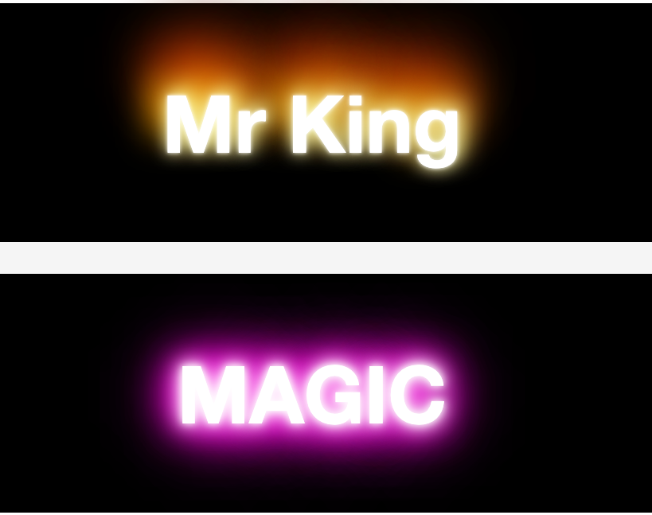
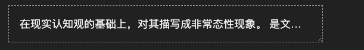

# css3 新增文本属性

## text-shadow

### 解释

**box-shadow: h-shadow v-shadow blur color**

**h-shadow** 阴影水平间距

**v-shadow** 阴影垂直间距

**blur** 阴影模糊强度

**color **阴影颜色


### 代码展示

```html
<!DOCTYPE html>
<html>
<head>
	<title>css3新增文本属性</title>
	<link rel="stylesheet" type="text/css" href="../../style.css">
	<style type="text/css">
		body {
			background-color: #f5f5f5;
			color: #555;
			text-align: center;
			font-size: 2em;
			font-family: 'Helvetica Neue',Helevetica,Arical;
		}
		
		.text {
			font-weight: 900;
			margin: 40px 0;
		}
		.text-1 {
			text-shadow: .1em .1em rgb(0,0,0,.3);
		}
		.text-2 {
			text-shadow: .1em .1em .2em rgb(0,0,0,.3);
		}
		.text-3 {
			color: white;
			text-shadow: .075em .08em .1em rgb(0,0,0,1);
		}
		.text-4 {
			text-shadow: .2em .5em .1em #ddd,
						 -.3em .1em .1em #aaa,
						 .4em -.3em .1em #888;
		}
		.text-5 {
			color: #54a;
			text-shadow: 0 0 .5em #87F,
						 0 0 .5em #87F,
						 0 0 .5em #87F,
						 0 0 .5em #87F;
		}
		.text-6 {
			color: #eee;
			text-shadow: -1px 0 black,
						 0 1px black,
						 1px 0 black,
						 0 -1px black;
		}
		.text-7 {
			color: transparent;
			text-shadow: 0 0 .1em rgb(0,0,0,.2),
						 0 0 .2em rgb(0,0,0,.2),
						 0 0 .3em rgb(0,0,0,.2);
		}

	</style>
</head>
<body>
	<h2 class="text text-1">.1em .1em rgb(0,0,0,.3)</h2>
	<h2 class="text text-2">.1em .1em .2em rgb(0,0,0,.3)</h2>
	<h2 class="text text-3">.075em .08em .1em rgb(0,0,0,1)</h2>
	<h2 class="text text-4">triple shadow</h2>
	<h2 class="text text-5">strengthen shadow</h2>
	<h2 class="text text-6">up down left right shadow</h2>
	<h2 class="text text-7">strengthen blur</h2>
</body>
</html>
```

### 实践

#### 效果图



#### 实现代码

```html
<!DOCTYPE html>
<html>
<head>
	<title>盒子阴影-应用</title>
	<link rel="stylesheet" type="text/css" href="../../style.css">
	<style type="text/css">
		.container {
			width: 960px;
			margin: 40px auto;
			font-size: 20px;
		}
		.box-hv {
			transition: all .6s;
		}
		.box-hv.left-right-open:hover {
			box-shadow: inset 0 0 0 0 rgb(0,0,0,.5),inset 0 0 0 0 rgb(0,0,0,.5);
		}
		.test {
			width: 671px;
			height: 607px;
			box-shadow: inset 335px 0 0 0 rgb(0,0,0,.5),inset -336px 0 0 0 rgb(0,0,0,.5);
			background-image: url('./demo-0.png');
		}
		
	</style>
</head>
<body>
	<div class="container">
		<div class="box-hv left-right-open test"></div>
	</div>
</body>
</html>
```


### text-shadow 3D文字


```html
<!DOCTYPE html>
<html>
<head>
	<title>text-shadow 3D 文字</title>
	<!-- <link rel="stylesheet" type="text/css" href="../../style.css"> -->
	<style type="text/css">
		body {
			font: blod 120px/1 Arial, sans-serif;
			background-color: #becccc;
			color: #fff;
		}
		
		.three-3D {
			font-size: 14em;
			text-align: center;
			letter-spacing: -3px;
			margin-top: 10%;
			text-shadow: 0 1px 0 hsl(174, 5%, 80%),
						 0 2px 0 hsl(174, 5%, 75%),
						 0 3px 0 hsl(174, 5%, 70%),
						 0 4px 0 hsl(174, 5%, 65%),
						 0 5px 0 hsl(174, 5%, 64%),
						 0 6px 0 hsl(174, 5%, 63%),
						 0 7px 0 hsl(174, 5%, 62%),
						 0 8px 0 hsl(174, 5%, 61%),
						 0 9px 0 hsl(174, 5%, 60%),
						 0 0 5px rgba(0,0,0,.05),
						 0 1px 3px rgba(0,0,0,.2),
						 0 3px 5px rgba(0,0,0,.2),
						 0 5px 10px rgba(0,0,0,.2),
						 0 10px 10px rgba(0,0,0,.2),
						 0 20px 20px rgba(0,0,0,.3);

		}
		
		
	</style>
</head>
<body>
	<h1 class="three-3D">KING</h1>
</body>
</html>
```


## text-overflow

### 解释

**text-overflow: [clip|ellipsis]**，设置文本超出对象时的显示方式，需要配合 **overflow:hidden 和 white-space:nowrap** 来使用

**clip** 默认值，不显示

**ellipsis** 溢出部分显示省略号


### 代码展示

```html
<!DOCTYPE html>
<html>
<head>
	<title>css3 text-overflow</title>
	<link rel="stylesheet" type="text/css" href="../../style.css">
	<style type="text/css">
		.container{
			width: 960px;
			margin: 50px auto;
		}
		.element {
			padding: 20px;
			max-width: 400px;
			border: 1px solid black;
			background-color: #f5f5f5;
			overflow: hidden;
			white-space: nowrap;
		}
		.element-1 {
			text-overflow: clip;
		}
		.element-2 {
			text-overflow: ellipsis;
		}
		.element-3 {
			text-overflow: ">>";
		}
		.element-4 {
			text-overflow: "(Read More...)";
		}

	</style>
</head>
<body>
	<div class="container">
		<p><code>text-overflow:clip</code></p>
		<div class="element element-1">
			在现实认知观的基础上，对其描写成非常态性现象。
			是文学体裁的一种，侧重于事件发展过程的描述。
			强调情节的生动性和连贯性，较适于口头讲述。已经发生事。
		</div>
		<p><code>text-overflow:ellipsis</code></p>
		<div class="element element-2">
			在现实认知观的基础上，对其描写成非常态性现象。
			是文学体裁的一种，侧重于事件发展过程的描述。
			强调情节的生动性和连贯性，较适于口头讲述。已经发生事。
		</div>

		<p><code>text-overflow:“>>”</code>(只针对火狐)</p>
		<div class="element element-3">
			在现实认知观的基础上，对其描写成非常态性现象。
			是文学体裁的一种，侧重于事件发展过程的描述。
			强调情节的生动性和连贯性，较适于口头讲述。已经发生事。
		</div>
		<p><code>text-overflow:“Read More” </code>(只针对火狐)</p>
		<div class="element element-4">
			在现实认知观的基础上，对其描写成非常态性现象。
			是文学体裁的一种，侧重于事件发展过程的描述。
			强调情节的生动性和连贯性，较适于口头讲述。已经发生事。
		</div>
	</div>
</body>
</html>
```


### 实践

#### 效果图



#### 实现代码

```html

<!DOCTYPE html>
<html>
<head>
	<title>css3 text-overflow 应用</title>
	<link rel="stylesheet" type="text/css" href="../../style.css">
	<style type="text/css">
		body {
			color: #eee;
			background-color: #212121;
			font-size: 18px;
			padding: 1em;
			font-family: arial;
		}
		body>div{
			padding: 1em;
			margin: 0 0 .5em 0;
		}
		.container {
			width: 11em;
			border: 1px dashed #999;
			overflow: hidden;
			resize: horizontal;
		}
		.ellipsis{
			overflow: hidden;
			white-space: nowrap;
			text-overflow: ellipsis;
		}


	</style>
</head>
<body>
	<div class="container">
		<div class="ellipsis">
			在现实认知观的基础上，对其描写成非常态性现象。
			是文学体裁的一种，侧重于事件发展过程的描述。
			强调情节的生动性和连贯性，较适于口头讲述。已经发生事。
		</div>
	</div>
</body>
</html>
```


