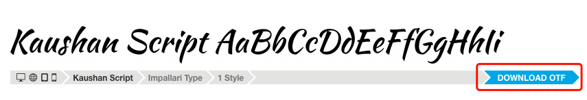
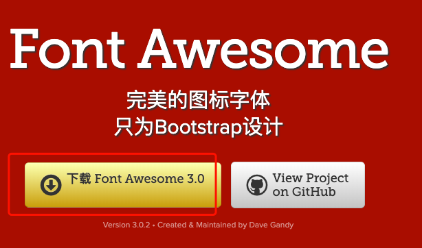
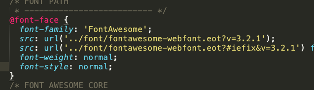
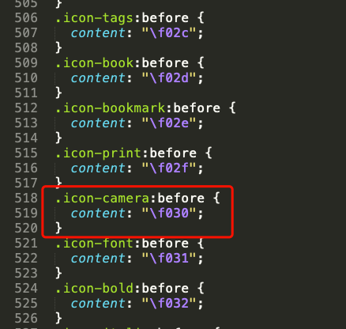

# 自定义字体的使用

## @font-face

### 在线工具

- 字体资源：<https://www.fontsquirrel.com/>
- 在线字体文件转换：<http://freefontconverter.com/>


### 解释

```css
<!--
@font-face {
    font-family:字体名称;
    src: url(字体路径1) format(字体格式),
         url(字体路径2) format(字体格式),
         ...;
}
-->
```

**字体格式：**

- **.ttf** , TrueType 字体
- **.otf** , OpenType 字体
- **.woff / .woff2 ** Web Open Font Format
- **.eot** IE 浏览器独有字体
- **svg** SVG字体渲染格式


### 应用展示

1. 下载字体资源

   

2. 在线转换多个字体格式，兼容多浏览器

3. 代码应用

```html
<!DOCTYPE html>
<html lang="en">
<head>
	<title>@font-face</title>
	<link rel="stylesheet" type="text/css" href="../../style.css">
	<style>
		@font-face {
			font-family: MyFont;
			src: url('./font/KaushanScript-Regular.ttf');
		}
		body {
			font-family: MyFont;
		}
	</style>
</head>
<body>
	<p>hello world</p>
</body>
</html>
```


## 字体图标

### 在线工具

<https://css-tricks.com/examples/IconFont/>

<https://www.bootcss.com/p/font-awesome/>

### 解释

使用字体图标的好处：

1. 适用性：一个图标字体比一些列的图标要小，而且图标字体加载立刻显示出来，图片则需要通过线下在显示。
2. 可扩展性：图标字体可设置颜色，大小。
3. 灵活性：可实现字体阴影、反转。
4. 兼容性：网页图标支持所有浏览器。


### 应用展示

1. 下载图标字体文件资源，例如使用 font-awesone

   

2. 查看其 css 文件，可知通过设置 @font-face 导入自定义图标字体

   

3. 解压，查看其 css 文件中，得知其使用规则，这里使用相机图标

   

4. 代码应用

   ```html
   <!DOCTYPE html>
   <html>
   <head>
   	<title>font-icon</title>
   	<link rel="stylesheet" type="text/css" href="./Font-Awesome-3.2.1/css/font-awesome.min.css">
   </head>
   <body>
   	<ul>
   		<li><i class="icon-camera"></i></li>
   		<li><i class="icon-camera-retro"></i></li>
   		<li><i style="background-color: black;" class="icon-light icon-camera-retro"></i></li>
   		
   	</ul>
   </body>
   </html>
   ```

   