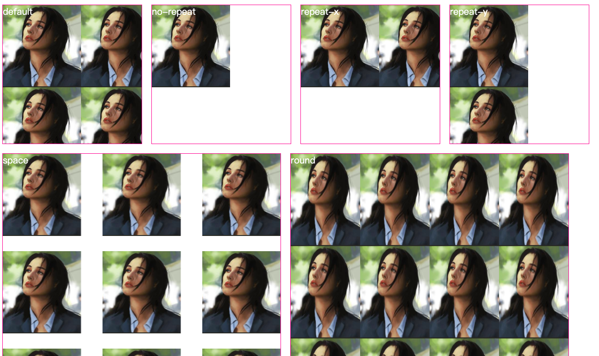

# 背景属性

## 相关属性回顾

### 在线工具

<https://css3gen.com/css-background-generator/>


### 解释

- background：color image repeat attachment position
- background-color：背景颜色
- background-repeat：背景重复
- background-attachment：背景图像依附方式
- background-position：背景图像位置


## background-repeat

### 解释

设置背景图片的是否重复即重复方式。

**space** 背景图像以相同的间距填充满整个容器

**round** 自动缩放直到适应，且填充整个容器

**repeat-x** 水平重复

**repeat-y** 垂直重复

**no-repeat** 不重复

### 效果图



### 代码展示 

```html
<!DOCTYPE html>
<html>
<head>
	<title>background-repeat</title>
	<style type="text/css">
		div{
			color: white;
			float: left;
			width: 300px;
			height: 300px;
			margin: 10px;
			border: 1px solid deeppink;
			background-image: url(./bg-s.png);
		}
		.no-repeat{
			background-repeat: no-repeat;
		}
		.repeat-x{
			background-repeat: repeat-x;
		}
		.repeat-y{
			background-repeat: repeat-y;
		}
		.space{
			width: 600px;
			height: 600px;
			background-repeat: space;
		}
		.round{
			width: 600px;
			height: 600px;
			background-repeat: round;
		}

	</style>
</head>
<body>
	<div >default</div>
	<div class="no-repeat">no-repeat</div>
	<div class="repeat-x">repeat-x</div>
	<div class="repeat-y">repeat-y</div>
	<div class="space"></div>
	<div class="round"></div>
</body>
</html>
```

## background-attachment

### 解释

设置背景图像是否固定或者随着页面的其余部分滚动。

**scroll** 默认值，本地视图不动，随主视图滚动

**fixed** 固定，相对于窗口固定

**local** 和主视图、本地视图一起滚动

### 代码展示

```html
<!DOCTYPE html>
<html>
<head>
	<title>background-attachment</title>
	<style type="text/css">
		div {
			color: deeppink;
			height: 300px;
			width: 600px;
			margin: 10px auto;
			background-image: url(./bg-s.png);
			overflow-x: hidden;
			overflow-y: scroll;
		}
		.scroll {
			background-attachment: scroll;
		}
		.fixed{
			background-attachment: fixed;
		}
		.local{
			background-attachment: local;
		}


	</style>
</head>
<body>
	<div class="scroll">
		<p>scroll</p>
		<p>scroll</p>
		<p>scroll</p>
		<p>scroll</p>
		<p>scroll</p>
		<p>scroll</p>
		<p>scroll</p>
		<p>scroll</p>
		<p>scroll</p>
	</div>
	<div class="fixed">
		<p>fixed</p>
		<p>fixed</p>
		<p>fixed</p>
		<p>fixed</p>
		<p>fixed</p>
		<p>fixed</p>
		<p>fixed</p>
		<p>fixed</p>
		<p>fixed</p>
		<p>fixed</p>
	</div>
	<div class="local"> 
		<p>local</p>
		<p>local</p>
		<p>local</p>
		<p>local</p>
		<p>local</p>
		<p>local</p>
		<p>local</p>
		<p>local</p>
		<p>local</p>
		<p>local</p>
	</div>
</body>
</html>
```


## background-position

### 解释

背景位置设置

### 代码展示

```html
<!DOCTYPE html>
<html>
<head>
	<title>background-position</title>
	<style type="text/css">
		div{
			color: white;
			float: left;
			width: 400px;
			height: 400px;
			margin: 10px;
			border: 1px solid deeppink;
			background-image: url(./bg-s.png);
			background-repeat: no-repeat;
		}
		.center{
			background-position: 50% 50%;
		}
		.right-bottom{
			background-position: right bottom;
		}
		.right{
			background-position: right;
		}
		.left{
			background-position: left;
		}
		.top{
			background-position: top;
		}
		.bottom{
			background-position: bottom;
		}
		.custom{
			background-position: right 20px bottom 20px;
		}
	</style>
</head>
<body>
	<div></div>
	<div class="center"></div>
	<div class="right-bottom"></div>
	<div class="left"></div>
	<div class="right"></div>
	<div class="top"></div>
	<div class="bottom"></div>
	<div class="custom"></div>
</body>
</html>
```


## background-origin

### 解释

背景图片的相对位置

**padding-box** 默认值，背景图片位置从 padding 外边缘，border 内边缘开始。

**border-box** 背景图片位置从 border 外边缘开始。

**content-box** 背景图片从 content 外边缘，padding 内边缘开始显示

### 代码展示

```html
<!DOCTYPE html>
<html>
<head>
	<title>background-origin</title>
<style type="text/css">
		div{
			color: white;
			float: left;
			width: 300px;
			height: 300px;
			margin: 10px;
			border: 20px dashed deeppink;
			background: url(./bg-s.png) no-repeat pink;
			padding: 20px;
		}
		.padding-box{
			background-origin: padding-box;
		}
		.border-box{
			background-origin: border-box;
		}
		.content-box{
			background-origin: content-box;
		}
		
	</style>
</head>
<body>
	<div class="padding-box">padding-box</div>
	<div class="border-box">border-box</div>
	<div class="content-box">content-box</div>
</body>
</html>
```


## background-clip

### 解释

裁剪背景图片

**border-box** 默认值，背景图片位置从元素边框外开始裁剪，超出边框之外的部分将被裁剪。

**padding-box** 背景图片位置从 padding 外边缘，border 内边缘开始。

**content-box** 背景图片从 content 外边缘，padding 内边缘开始显示

**text** 是 webkit 内核的私有属性，可实现文字颜色为背景图片

### 代码展示

```html
<!DOCTYPE html>
<html>
<head>
	<title>background-origin</title>
<style type="text/css">
		div{
			color: deeppink;
			float: left;
			width: 300px;
			height: 300px;
			margin: 10px;
			border: 20px dashed deeppink;
			background: url(./bg-m.png) no-repeat pink;
			padding: 20px;
		}
		.border-box{
			background-clip: border-box;
		}
		.padding-box{
			background-clip: padding-box;
		}
		.content-box{
			background-clip: content-box;
		}
		.text{
			-webkit-text-fill-color: transparent;
			-webkit-background-clip: text;
			font-weight: bold;
			font-size: 250px;
			text-align: center;
		}
		
	</style>
</head>
<body>
	<div class="border-box">border-box</div>
	<div class="padding-box">padding-box</div>
	<div class="content-box">content-box</div>
	<div class="text">M</div>
</body>
</html>
```

## background-size

### 解释

背景图片大小解析。

**auto** 默认值，保持图片宽高。

**自定义宽高**

**cover**  将背景图片等比缩放到完全覆盖容器

**contain**  将背景图片等比缩放到宽度或高度与容器宽度或高度相当

### 代码展示

```html
<!DOCTYPE html>
<html>
<head>
	<title>background-size</title>
<style type="text/css">
		div{
			color: deeppink;
			float: left;
			width: 600px;
			height: 600px;
			margin: 10px;
			border: 10px solid deeppink;
			background: url(./bg-m.png) no-repeat;
		}
		.auto{
			background-size: auto;
		}
		.custom1{
			background-size: 300px;
		}
		.custom2{
			background-size: 50% 50%;
		}
		.cover{
			background-size: cover;
		}
		.contain{
			background-size: contain;
		}

	</style>
</head>
<body>
	<div class="auto"></div>
	<div class="custom1"></div>
	<div class="custom2"></div>
	<div class="cover"></div>
	<div class="contain"></div>
</body>
</html>
```


