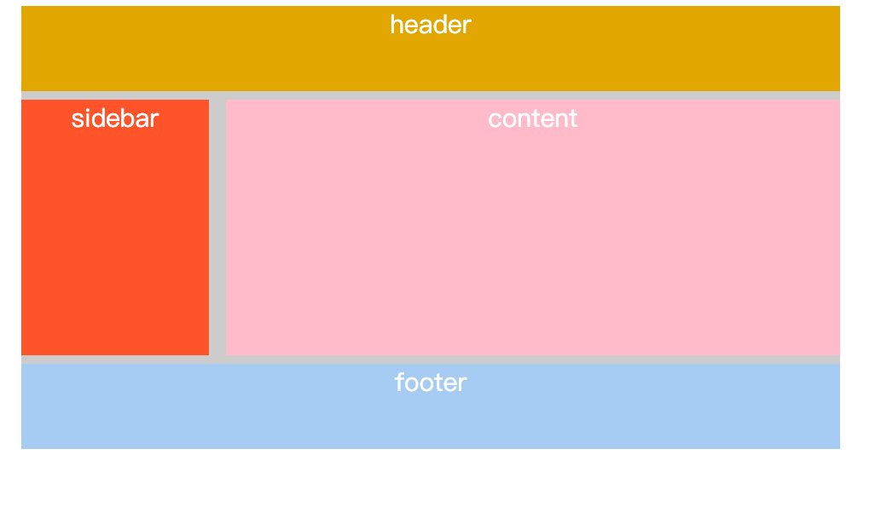
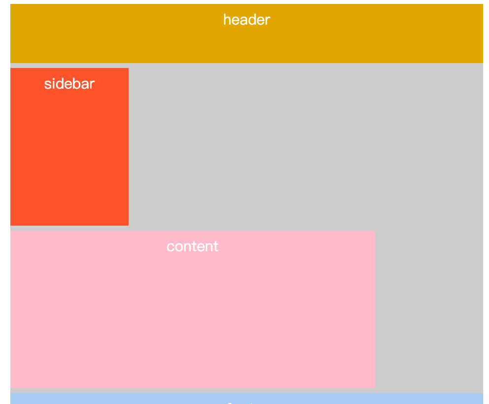
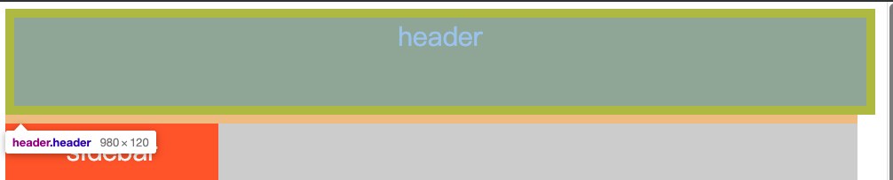
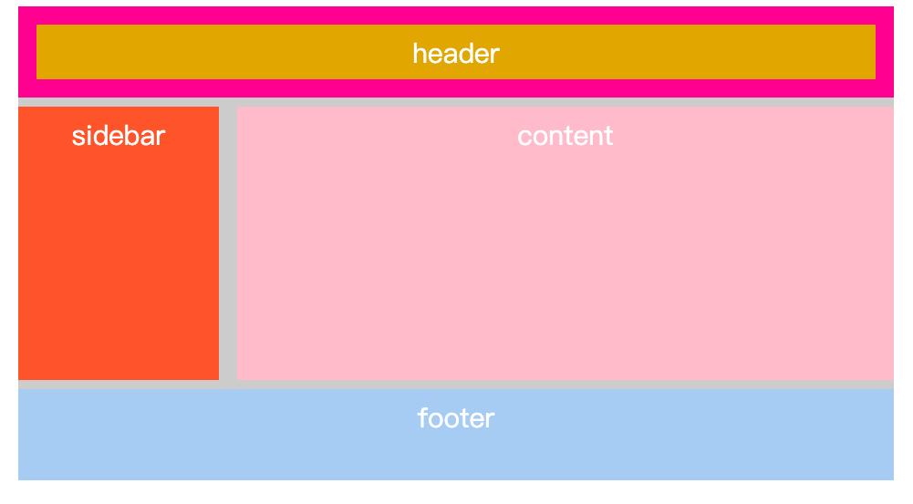

# css3 盒子模型

## box-sizing 布局

### 解释

box-sizing 属性定义了 user agent 应该如何计算一个元素的总宽度和总高度。

- **content-box** 默认值，如果你设置一个元素的宽为100px，那么这个元素的内容区会有100px 宽，并且任何边框和内边距的宽度都会被增加到最后绘制出来的元素宽度中。
- **border-box** 告诉浏览器：你想要设置的边框和内边距的值是包含在width内的。也就是说，如果你将一个元素的width设为100px，那么这100px会包含它的border和padding，内容区的实际宽度是width减去(border + padding)的值。大多数情况下，这使得我们更容易地设定一个元素的宽高。


### 测试初始代码

```html
<!DOCTYPE html>
<html>
<head>
	<title>bos-sizing</title>
	<style type="text/css">
		.container{
			width:960px;
			margin: 0 auto;
			color:#fff;
			font-size: 30px;
			text-align: center;
			background-color: #ccc;
		}
		.header{
			height: 100px;
			background-color: goldenrod;
			margin-bottom: 10px;
		}
		.sidebar{
			width: 220px;
			height: 300px;
			margin-right: 20px;
			margin-bottom: 10px;
			background-color: tomato;
			float:left;
		}
		.content{
			width: 720px;
			height: 300px;
			background-color: pink;
			margin-bottom: 10px;
			float:left;
		}
		.footer{
			background-color: #abcdef;
			text-align: center;
			height: 100px;
			clear:both;
		}
	</style>
</head>
<body>
	<div class="container">
		<header class="header">header</header>
		<section class="sidebar">sidebar</section>
		<section class="content">content</section>
		<footer class="footer">footer</footer>
	</div>
</body>
</html>
```


### 正常布局时



此时，sidebar 的宽度和 content 的宽度和 sidebar 的左边距加起来，刚好为 container 的宽度。

### content-box

#### 添加 padding 内边距

给各个子盒子添加 padding: 10px; 查看其效果。



此时，sidebar 和 content 和内边距和外边距加起来超过父盒子，因此导致出现这种情况。

#### 设置 header 宽度为 100%

此时 header 宽度和内边距加起来大于父容器，导致超出了父容器区域。



### border-box

此时给所有的盒子加上 box-sizing: border-box ，随意添加指定宽度的边框查看效果。

