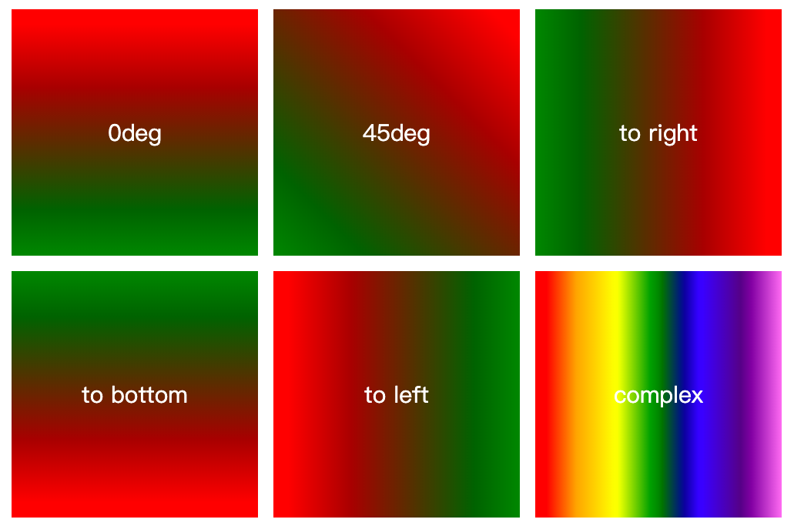
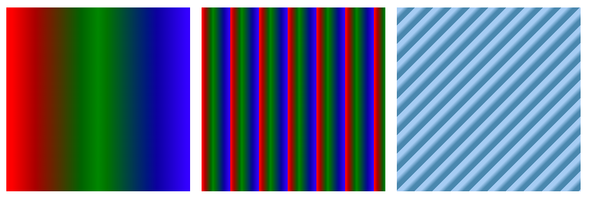
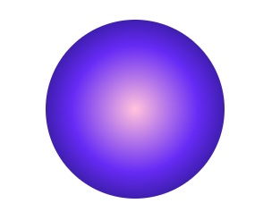

# css3 渐变

## 在线工具

<http://angrytools.com/gradient/>

<https://leaverou.github.io/css3patterns/#>

## 线性渐变 linear-gradient

### 解释

**linear-gradient(direction, color-stop1, color-stop2, ...);**

**direction** 渐变方向或角度

**color-stop2, ...** 用于指定渐变的起止颜色

### 代码展示

```html
<!DOCTYPE html>
<html>
<head>
	<title>linear-gradient</title>
	<style type="text/css">
		.container{
			width:1200px;
			margin: 0 auto;
			color:#fff;
			font-size: 30px;
			text-align: center;

		}
		.container>div{
			margin: 10px;
			float: left;
			width: 320px;
			height: 320px;
			line-height: 320px;
		}
		.angle-gradient-0deg {
			background: linear-gradient(0deg, green, red);
		}
		.angle-gradient-45deg{
			background: linear-gradient(45deg, green, red);
		}
		.angle-gradient-right{
			background: linear-gradient(to right, green, red);
		}
		.angle-gradient-bottom{
			background: linear-gradient(to bottom, green, red);
		}
		.angle-gradient-left{
			background: linear-gradient(to left, green, red);
		}
		.angle-gradient-complex{
			background: linear-gradient(to right, red,orange,yellow,green,blue,indigo,violet);
		}

		
	</style>
</head>
<body>
	<div class="container">
		<div class="angle-gradient-0deg">0deg</div>
		<div class="angle-gradient-45deg">45deg</div>
		<div class="angle-gradient-right">to right</div>
		<div class="angle-gradient-bottom">to bottom </div>
		<div class="angle-gradient-left">to left</div>
		<div class="angle-gradient-complex">complex</div>

	</div>
</body>
</html>
```

### 效果图




## 重复线性渐变

### 解释

**repeating-linear-gradient(angle | to side-or-corner, color-stop1, color-stop2, ...);**

**angle** 渐变角度

**side-or-corner** 指定线性渐变的起始位置。由两个关键字组成：第一个为指定水平位置(left 或 right)，第二个为指定垂直位置（top 或bottom）。 顺序是随意的，每个关键字都是可选的。

**color-stop2, ...** 指定渐变的起止颜色，由颜色值、停止位置（可选，使用百分比指定）组成。

### 代码展示

```html
<!DOCTYPE html>
<html>
<head>
	<title>repeat-gradient</title>
	<style type="text/css">
		.container{
			width:1200px;
			margin: 0 auto;
			color:#fff;
			font-size: 30px;
			text-align: center;

		}
		.container>div{
			margin: 10px;
			float: left;
			width: 320px;
			height: 320px;
			line-height: 320px;
		}
		.box1{
			background-image: repeating-linear-gradient(to right,red,green,blue);
		}
		.box2{
			background-image: repeating-linear-gradient(to right,red ,green 20px,blue 50px);
		}
		.box3{
			background-image: repeating-linear-gradient(135deg,#abcdef,#abcdef .25em, #58a, #58a .75em);
		}
	</style>
</head>
<body>
	<div class="container">
		<div class="box1"></div>
		<div class="box2"></div>
		<div class="box3"></div>
	</div>
</body>
</html>
```

### 效果图



## 径向渐变

### 解释 

**radial-gradient(shape size at position, start-color, ..., last-color);**

| 值                             | 描述                                                         |
| ------------------------------ | ------------------------------------------------------------ |
| *shape*                        | 确定圆的类型:<br />- ellipse (默认): 指定椭圆形的径向渐变。<br />- circle ：指定圆形的径向渐变 |
| *size*                         | 定义渐变的大小，可能值：<br />- farthest-corner (默认) : 指定径向渐变的半径长度为从圆心到离圆心最远的角<br />- closest-side ：指定径向渐变的半径长度为从圆心到离圆心最近的边<br />- closest-corner ： 指定径向渐变的半径长度为从圆心到离圆心最近的角<br />- farthest-side ：指定径向渐变的半径长度为从圆心到离圆心最远的边 |
| *position*                     | 定义渐变的位置。可能值：<br />- **center**（默认）：设置中间为径向渐变圆心的纵坐标值。<br />- **top**：设置顶部为径向渐变圆心的纵坐标值。<br />- **bottom**：设置底部为径向渐变圆心的纵坐标值。 |
| *start-color, ..., last-color* | 用于指定渐变的起止颜色。                                     |

### 代码展示

```html
<!DOCTYPE html>
<html>
<head>
	<title>radial-gradient</title>
	<style type="text/css">
		.demo{
			margin: 100px;
			width: 200px;
			height: 200px;
			border-radius: 100%;
			background-image: radial-gradient(circle at center, #f9c7dc,#5950ec,#04164a);
		}
		.demo:hover{

			background-image: radial-gradient(circle at center, #f9c7dc,#e982ad,#ec568c);
		}
	</style>
</head>
<body>
	<div class="demo"></div>
</body>
</html>
```

### 效果图



