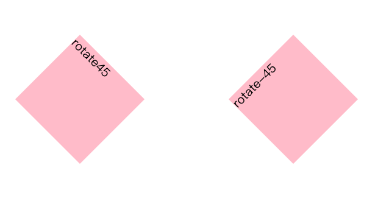
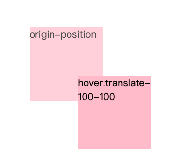

# css3 转换

## transform

可以通过一个或者多个转换方法实现转换效果，多个之间以空格划分。

## 在线工具

<https://www.html.cn/tool/css3Preview/Transform.html>

<http://thewebrocks.com/demos/3D-css-tester/>

## 2D

### 2D 旋转 rotate(x deg)

#### 解释

定义 2D 旋转，在参数中规定角度。

拓展：rotateX，rotateY，rotateZ

#### 效果图



#### 示例代码

```html
<!DOCTYPE html>
<html>
<head>
	<title>rotate</title>
	<link rel="stylesheet" type="text/css" href="../../style.css">
	<style type="text/css">

		.container>div{
			float: left;
			width:150px;
			height: 150px;
			background-color: pink;
			margin:100px;
		}
		.rotate45{
			transform: rotate(45deg);
		}
		.rotate-45{
			transform: rotate(-45deg);
		}
	</style>
</head>
<body>
	<div class="container">
		<div class="rotate45">rotate45</div>
		<div class="rotate-45">rotate-45</div>	
	</div>
</body>
</html>
```


### 2D 位移 translate

#### 解释

translate(x,y)，2d平移。

第一个参数为水平方向平移距离；

第二个参数为垂直方向平移动距离；

扩展：translateX，translateY，translateZ

#### 效果图



#### 示例代码

```html
<!DOCTYPE html>
<html>
<head>
	<title>rotate</title>
	<link rel="stylesheet" type="text/css" href="../../style.css">
	<style type="text/css">

		.container>div{
			float: left;
			width:150px;
			height: 150px;
			background-color: pink;
			margin:100px;
		}
		.orgin-left-top-30{
			transform-origin: left top;
			transform: rotate(30deg);
		}
		.translate-100-100{
			transition: all 1s;
		}
		.translate-100-100:hover{
			transform: translate(100px,100px);
		}
	</style>
</head>
<body>
	<div class="container">
		<div class="orgin-left-top-30">orgin-left-top and rotate(30deg)</div>
		<div class="translate-100-100">hover:translate-100-100</div>
</body>
</html>
```


### 2D 缩放 scale(x,y)

#### 解释

定义 2D 缩放转换。

scale(X,Y) ，X表示水平方向缩放的倍数 | Y表示垂直方向的缩放倍数
Y是一个可选参数，没有设置的话，则表示X，Y两个方向的缩放倍数是一样的。并以X为准。

#### 示例代码

```html
<!DOCTYPE html>
<html>
<head>
	<title>rotate</title>
	<link rel="stylesheet" type="text/css" href="../../style.css">
	<style type="text/css">

		.container>div{
			float: left;
			width:150px;
			height: 150px;
			background-color: pink;
			margin:100px;
		}
		
		.scale-2:hover{
			transform: scale(2);
		}
	</style>
</head>
<body>
	<div class="container">
		
		<div class="scale-2">hover:scale-2</div>
	</div>
</body>
</html>
```


### transform-origin

改变元素的转换基点。

transform: 水平方向值 垂直方向值

参数值可为：具体长度|百分比|关键字

水平方向关键字：left|center|right

垂直方向关键字：top|center|bottom


## 3D

### 3D转换解析

- **transform-style** 规定呗嵌套元素如何在3D空间中显示，
  - flat：默认值，指定子元素位于此元素所在的平面内；
  - perserve-3d：规定子元素位于三维空间内
- **perspective** 规定元素的透视效果
  - none
  - length：指定观察者距离平面的距离，为其元素及其内容应用透视效果；
- **perspective-origin** 指定透视点点位置
  - length
  - percentage
  - 关键字
- **backface-visibility** 规定元素在不面对屏幕时是否可见
  - visible：默认值，指定元素背面可见，允许显示正面的镜像；
  - hidden：指定元素背面不可见；

### 示例代码

```html
<!DOCTYPE html>
<html>
<head>
	<title>3D transform</title>
	<link rel="stylesheet" type="text/css" href="../../style.css">
	<style type="text/css">
		.card{
			margin: 100px;
			width: 600px;
			font-size: 35px;
			text-align: center;
		}
		.card>a{
			display: inline-block;
			width: 100px;
			height: 100px;
			margin: 5px;
		}
		.card article{
			display: block;
			width: 100%;
			height: 100%;
			background-color: #333;
			color: #fff;
			line-height: 100px;
			box-shadow: 0 0 6px -2px #000,
						0 0 45px -20px #000;
			transition: all .8s;
			transform-style: preserve-3d;
			perspective: 300px;

		}
		.card>a:hover article {
			transform: 	rotateZ(180deg) 
						rotateY(180deg) 
						rotateX(180deg) 
						scale(2.2)
						translate3d(12px,12px,12px);
		}
		.card>a:nth-child(1):hover article{
			background-color: #e29090;
		}
		.card>a:nth-child(2):hover article{
			background-color: #abcdef;
		}
		.card>a:nth-child(3):hover article{
			background-color: #7674ea;
		}
		.card>a:nth-child(4):hover article{
			background-color: #7beab2;
		}
		
	</style>
</head>
<body>
	<section class="card">
		<a href="#"><article>Hello</article></a>
		<a href="#"><article>Hello</article></a>
		<a href="#"><article>Hello</article></a>
		<a href="#"><article>Hello</article></a>
	</section>
</body>
</html>
```

