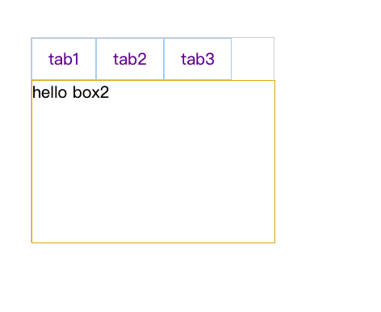

# tab选项卡

## 效果图
 

## 实现方法
1. 标签栏，使用向左浮动，并且使用 clearfix 清除浮动；
2. 内容框，将每一个子内容框box包裹在 tab-wrap 盒子中，并设置 tab-wrap 盒子为相对定位，每一个子内容框设置为绝对定位，左距和顶距设为0，使用 z-index 来选择性显示子内容；
3. 使用目标伪类选择器，设置被选中的box的z-index为2。

## 实现代码
```html
<!DOCTYPE html>
<html>
<head>
	<title>选项卡</title>
	<link rel="stylesheet" type="text/css" href="../../style.css">
	<style>
		.tab-area {
			width: 300px;
			border: 1px solid #ccc;
			margin: 100px;
		}
		.tabs>li {
			float: left;
		}
		.tabs>li>a {
			padding: 10px 20px;
			display: block;
			height: 30px;
			line-height: 30px;
			border: 1px solid #abcdef;
		}
		.tab-wrap {
			height: 200px;
			position: relative;		
		}
		.tab-wrap>div {
			border: 1px solid goldenrod;
			background-color: #fff;
			position: absolute;
			left: 0;
			top: 0;
			height: 200px;
			width: 100%;	
		}
		#box1 {
			z-index: 1;
		}
		#box1:target,#box2:target,#box3:target{
			z-index: 2;
		}
	</style>
</head>
<body>
	<div class="tab-area">
		<ul class="tabs clearfix" >
			<li><a href="#box1">tab1</a></li> 
			<li><a href="#box2">tab2</a></li> 
			<li><a href="#box3">tab3</a></li> 
		</ul>
		<div class="tab-wrap">
			<div id="box1">hello box1</div>
			<div id="box2">hello box2</div>
			<div id="box3">hello box3</div>
		</div>
	</div>
</body>
</html>
```
