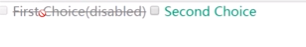
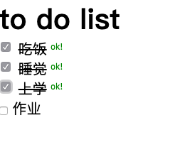
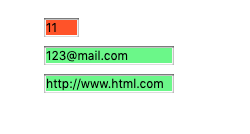
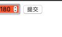

#  表单各组件的选择器

## 1.disabled、enabled选择器

### 效果图

 

### 实现代码

```html
<!DOCTYPE html>
<html>
<head>
	<title>选项卡</title>
	<link rel="stylesheet" type="text/css" href="../../style.css">
	<style>
		input[type="checkbox"]:enabled+label {
			color: #096;
		}
		input[type="checkbox"]:disabled+label {
			text-decoration: line-through;
			cursor: not-allowed;

			color: grey;
		}
	</style>
</head>
<body>
	<form>
		<input type="checkbox" name="test[]" id="checkbox-1" disabled>
		<label for="checkbox-1" > disabled</label>
		<input type="checkbox" name="test[]" id="checkbox-2">
		<label for="checkbox-2" > enabled</label>
	</form>
</body>
</html>
```


## 2.checked 选择器

### 效果图



### 代码实现

```html
 <!DOCTYPE html>
<html>
<head>
	<title>checked选择器</title>
	<link rel="stylesheet" type="text/css" href="../../style.css">
	<style type="text/css">
		input[type="checkbox"]:checked{
			width: 20px;
			height: 20px;

		}
		input[type="checkbox"]:checked+label{
			text-decoration: line-through;
		}
		input[type="checkbox"]:checked::after{
			padding-left: 6em; 
			content: "ok!";
			color: green;
		}
	</style>
</head>
<body>
	<h1> to do list</h1>
	<input type="checkbox" name="todo[]" id="todo1" checked>
	<label for="todo1">吃饭</label>
	<br>
	<input type="checkbox" name="todo[]" id="todo2">
	<label for="todo2">睡觉</label>
	<br>
	<input type="checkbox" name="todo[]" id="todo3">
	<label for="todo3">上学</label>
	<br>
	<input type="checkbox" name="todo[]" id="todo4">
	<label for="todo4">作业</label>
	<br>
</body>
</html>
```


## 3.invalid和valid 选择器

### 效果图



### 解释

**:valid** 指定元素通过了HTML5元素校验时样式

**:invalid** 指定了元素未通过HTML5元素校验时的样式 


### 代码实现

```html
<!DOCTYPE html>
<html>
<head>
	<title>valid-invalid选择器</title>
	<link rel="stylesheet" type="text/css" href="../../style.css">
	<style type="text/css">
		.container{
			margin: 100px;
		}
		input:valid{
			background-color: lightgreen;
		}
		input:invalid{
			background-color: tomato;
		}
	</style>
</head>
<body>
	<form class="container">
		<input type="number" name="" id="" min="1" max="10" value="5"> <br>
		<input type="email" name="" id=""> <br>
		<input type="url" name="" id=""> <br>

	</form>
</body>
</html>
```


## 4.in-range和out-of-range选择器

### 效果图




### 解释

**:in-range** 设置输入内容在指定范围内，min～max之间

**:out-of-range** 设置输入内容不在指定范围内


###  代码实现

```html
<!DOCTYPE html>
<html>
<head>
	<title>in-range和out-of-range选择器</title>
	<link rel="stylesheet" type="text/css" href="../../style.css">
	<style>
		input[type="number"]:in-range{
			background-color: lightgreen;
		}
		input[type="number"]:out-of-range{
			background-color: tomato;
		}
	</style>
</head>
<body>
	<form>
		<input type="number" name="age" id="" min="1" max="150">
		<input type="submit" >
	</form>
</body>
</html>
```


## 5.read-only和read-write选择器

### 效果图

略

### 解释

**:read-only**  设置元素具有只读状态时的样式

**:read-write** 设置元素可编辑时的样式

### 代码实现

略


 ## 6.required和optional选择器

###  效果图

略

### 解释

**:required** 

**:optional** 

代码实现

略


## 7.empty

### 效果图

略

### 解释

**:empty** 选中页面中内容为空的元素

### 代码实现

略