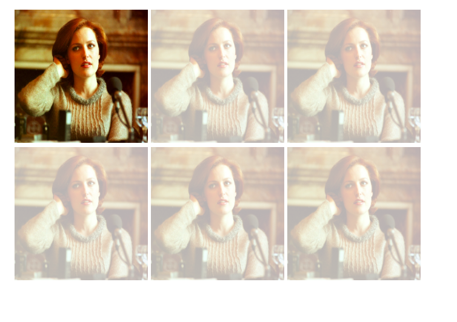

# not 选择器

## 1. not 选择器

### 效果图

略

### 解释

**:not** 用来定位不匹配该选择器的元素

### 代码实现

```html
<!DOCTYPE html>
<html>
<head>
	<title>选项卡</title>
	<link rel="stylesheet" type="text/css" href="../../style.css">
	<style>
		div:not(.box) {
			background-color: pink;
		}
		input:not([type="text"]) {
			background-color: grey;
		}
		div:not(:hover) {
			background-color: lightgreen;
		}
	</style>
</head>
<body>
	<div class="">123</div>
	<div class="">123</div>
	<div class="box">123</div>
	<div class="">123</div>
	<hr>
	<input type="text" name=""/><br>
	<input type="password" name=""/>

</body>
</html>
```


## 2. not 实战

### 效果图



### 解释

**.imgs:hover li:not(:hover) ** 选择被鼠标悬浮之下的图片集合imgs，再选择imgs中没有没悬浮到img的样式。


### 代码实现

```html
<!DOCTYPE html>
<html>
<head>
	<title>not 应用实战</title>
	<link rel="stylesheet" type="text/css" href="../../style.css">
	<style type="text/css">
		.imgs img {
			width: 220px;
			height: 220px;
		}
		.imgs>li{
			float: left;
			margin-left: 5px;
		}
		.imgs {
			width: 675px;
			margin: 20px auto;
		}
		/* 饱和度效果*/
		.imgs:hover li:not(:hover) {
			opacity: .3;
			filter: alpha(opacity=30);
		}
		/* 模糊效果 */
		/*.imgs:hover li:not(:hover) {
			filter: blur(3px);
		}*/
	</style>
</head>
<body>
	<ul class="imgs clearfix">
		<li></li>
		<li></li>
		<li></li>
		<li></li>
		<li></li>
		<li></li>
	</ul>
</body>
</html>
```

