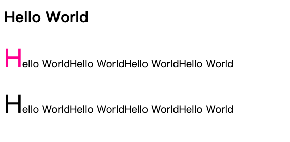
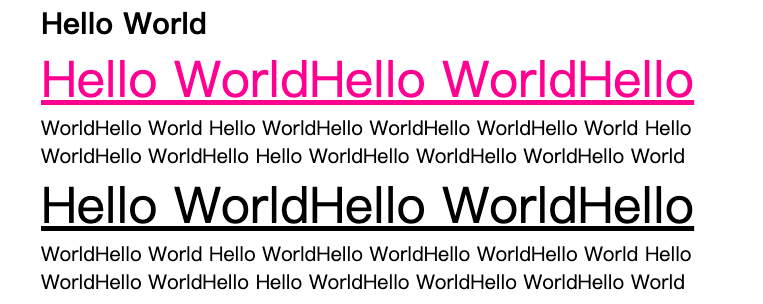

# first-letter 和 first-line 伪元素

## 1. first-letter

### 效果图



### 解释

**::first-letter** 设置对象内的第一个字符的样式，不能选中行内元素的第一个字符。

### 代码实现

```html
<!DOCTYPE html>
<html>
<head>
	<title>first-letter</title>
	<style type="text/css">
		p:first-of-type::first-letter {
			color: deeppink;
		}
		p::first-letter {
			font-size: 2.5em;
		}
	</style>
</head>
<body>
	<div class="container">
		<article>
			<h2>Hello World</h2>
			<p>
				Hello WorldHello WorldHello WorldHello World
			</p>
			<p>
				Hello WorldHello WorldHello WorldHello World
			</p>
		</article>
	</div>
</body>
</html>
```


## 2. first-line

### 效果图



### 解释

**::first-line** 设置对象内的第一行所有字符的样式。

### 代码实现

```html
<!DOCTYPE html>
<html>
<head>
	<title>first-line</title>
	<link rel="stylesheet" type="text/css" href="../../style.css">
	<style type="text/css">
		p:first-of-type::first-line {
			color: deeppink;
		}
		p::first-line {
			font-size: 2.5em;
			text-decoration: underline;
		}
	</style>
</head>
<body>
	<div class="container">
		<article>
			<h2>Hello World</h2>
			<p>
				Hello WorldHello WorldHello WorldHello World
				Hello WorldHello WorldHello WorldHello World
				Hello WorldHello WorldHello 
				Hello WorldHello WorldHello WorldHello World
			</p>
			<p>
				Hello WorldHello WorldHello WorldHello World
				Hello WorldHello WorldHello WorldHello World
				Hello WorldHello WorldHello 
				Hello WorldHello WorldHello WorldHello World
			</p>
		</article>
	</div>
</body>
</html>
```

