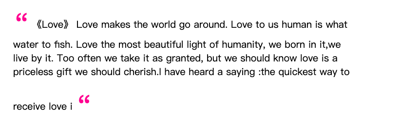

# before 和 after 伪元素

## 1. before 和 after

### 效果图



### 解释

**::before** 可以在指定元素之前添加内容。

**::after** 可以在指定元素之后添加内容。

### 代码实现

```html
<!DOCTYPE html>
<html>
<head>
	<title>after 使用演示</title>
	<link rel="stylesheet" type="text/css" href="../../style.css">
	<style type="text/css">
		blockquote::before,
		blockquote::after {
			content: "\201C";
			color: deeppink;
			font-size: 3em;
			position: relative;
			top:20px;
		}
	</style>
</head>
<body>
	<div class="container">
		<blockquote>
			《Love》 Love makes the world go around.
			Love to us human is what water to fish.
			Love the most beautiful light of humanity,
			we born in it,we live by it.
			Too often we take it as granted,
			but we should know love is a priceless 
			gift we should cherish.I have heard a saying 
			:the quickest way to receive love i
		</blockquote>
	</article>
</body>
</html>
```

