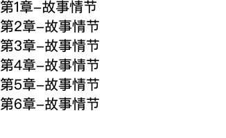

# 计数器 counter

## 效果图



## 解释

**counter-reset** 设置计数器标识，初始值默认0

**counter-increment** 设置增量，默认是 1

**counter(name)** 用于得到计数器字符


## 实现代码

```html
<!DOCTYPE html>
<html>
<head>
	<title>计数器</title>
	<link rel="stylesheet" type="text/css" href="../../style.css">
	<style type="text/css">
		.chapter {
			counter-reset: section 0;
		}
		.chapter>li::before {
			content: "第"counter(section)"章-";
			counter-increment: section 1;

		}
	</style>
</head>
<body>
	<ul class="chapter">
		<li>故事情节</li>
		<li>故事情节</li>
		<li>故事情节</li>
		<li>故事情节</li>
		<li>故事情节</li>
		<li>故事情节</li>
	</ul>
</body>
</html>
```

